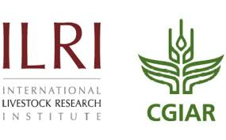
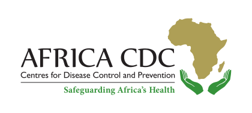

Building capacity in pathogen genomics and bioinformatics in Africa:
This training course aims to provide intensive hands-on training on genomics and
bioinformatics to participants from national public health institutes (NPHIs) in
Africa. Participants will gain in-depth and foundational principles and
skills on sequence data generation and analysis using bioinformatics tools with
an aim of translating this knowledge into actionable steps in outbreaks
investigation and control for public health surveillance

  

#### Programme


  

#### Partners
<!-- Our [community forum](https://community.p2pu.org/c/tech/course-in-a-box/78) is a great place to ask questions or find help when you get stuck. Feel free to post there anytime!

You can also hire P2PU to provide support with learning design, technical setup, course customizations, or web hosting. If you’re interested in collaborating on a project, reach out to us at thepeople@p2pu.org -->

This course has been organised by [ILRI](https://www.ilri.org/) (International
Livestock Research Institute) in collaboration with [Africa
CDC](https://africacdc.org) (Africa Centres for Disease Control and Prevention),
part of the African Union (AU)
and [ASLM](https://aslm.org/) (African Society for
Laboratory Medicine)

  
  
  

  

<!-- #### About Course-in-a-Box

P2PU created Course-in-a-Box in 2014 as a free and lightweight tool for building online courses. We wanted to preserve the modular structure of MOOCs outside of the bulky (and often proprietary) environment of learning/content management systems. Course-in-a-Box is open-source, and we welcome contributions [on our Github repo](https://github.com/p2pu/course-in-a-box).

p.s. Designing a course for learning circles? [Check out the Learning Circle Course Creation guide](https://docs.p2pu.org/courses/creating-courses) for some best practices on course design. -->
